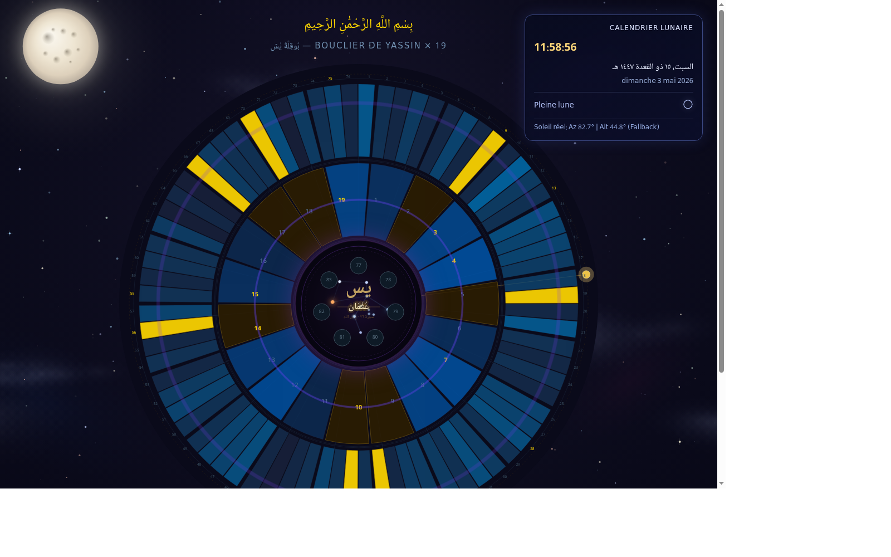

# Bouclier de Yassin x 19

[](https://el-hadj10.github.io/Yassin_19/)
[](LICENSE)



Visualisation spirituelle et mathematique de la sourate Yassin (36), articulee autour du nombre 19.

Ce projet combine:
- analyse Abjad de 83 versets
- repartition en 19 secteurs + 7 versets au noyau
- rendu statique SVG (matplotlib)
- rendu interactif D3.js avec cosmos anime, lune, calendrier lunaire et soleil temps reel

## Vision

Le bouclier propose une lecture symbolique en couches:
- couche mathematique: Abjad, signatures modulo 19, frequences Ya/Sin
- couche geometrique: 19 gardiens en couronne + noyau central
- couche contemplative: Orion, respiration du coeur, univers vivant

## Fonctionnalites

- Analyse Abjad complete (systeme Mashriqi classique)
- Detection des versets multiples de 19
- Comptage des lettres ي et س par verset et global
- Structure 19 secteurs (4 versets chacun) + noyau (7 versets)
- Export JSON pour la visualisation web
- Export SVG haute qualite
- Interface D3.js immersive:
  - dôme circulaire interactif
  - constellation d Orion animee au centre
  - effets de respiration et ondes du coeur
  - pleine lune dans le cosmos
  - nuages, nebuleuses, etoiles filantes
  - calendrier lunaire temps reel
  - cercle solaire temps reel (azimut/altitude)
  - tooltip solaire au survol

## Architecture

```text
.
├── core/
│   ├── abjad.py
│   ├── analyzer.py
│   ├── structure.py
│   └── export.py
├── data/
│   └── yassin.txt
├── visual/
│   └── bouclier.py
├── web/
│   ├── index.html
│   └── data.json
├── main.py
├── requirements.txt
└── bouclier_yassin_19.svg
```

## Installation

Prerequis:
- Python 3.10+
- Linux/macOS/WSL recommande

```bash
python3 -m venv .venv
source .venv/bin/activate
pip install -r requirements.txt
```

## Execution

### 1) Generer les artefacts

```bash
python3 main.py
```

Genere:
- bouclier_yassin_19.svg
- web/data.json

### 2) Lancer la version web interactive

```bash
python3 -m http.server 8000 --directory web
```

Puis ouvrir:
- http://localhost:8000

## Donnees et methodologie

- Source texte: 83 versets (1 verset par ligne) dans data/yassin.txt
- Abjad: normalisation des variantes d Alif/Hamza et map classique jusqu a 1000
- Structure: 83 mod 19 = 7, d ou noyau residuel de 7 versets
- Calendrier hijri: offset local d observation applique pour la France

## Scripts principaux

- main.py: orchestrateur global (analyse + structure + export)
- core/abjad.py: calculs Abjad
- core/analyzer.py: stats versets et globales
- core/structure.py: mapping 19 secteurs / noyau
- core/export.py: serialization web/data.json
- visual/bouclier.py: rendu SVG polaire
- web/index.html: scene interactive D3.js

## Roadmap

- Parametre UI pour ajuster l offset hijri (-1/0/+1)
- Export PNG en plus du SVG
- Publication GitHub Pages
- Mode comparaison entre differentes conventions d observation lunaire

## Auteur

Nour (El-hadj10)

Si ce projet te parle, tu peux ouvrir une issue ou proposer une extension de visualisation.
